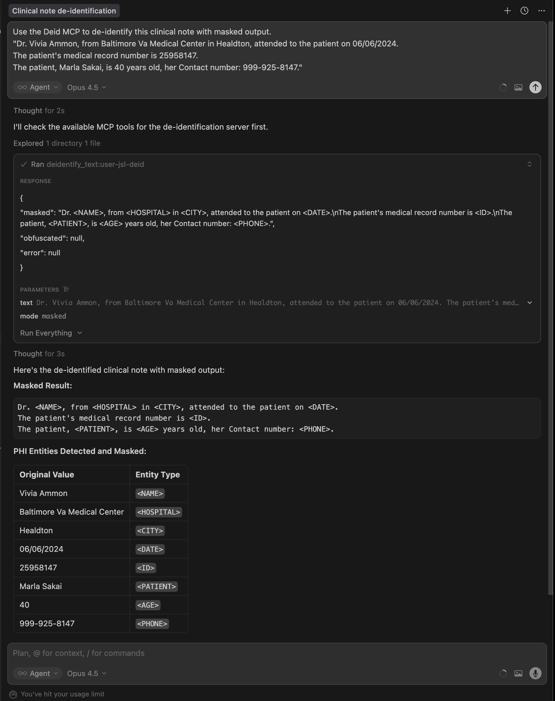
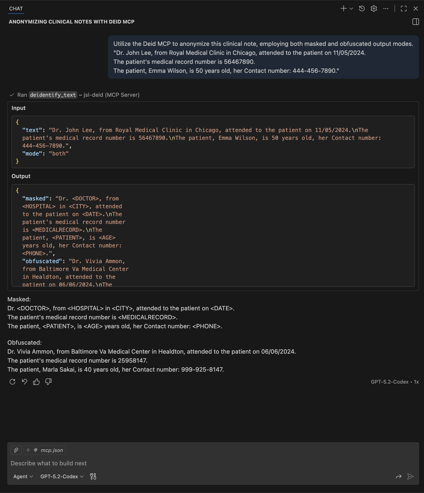

# Bring Clinical De-identification to Your IDE: MCP Servers for Healthcare NLP

*Integrate Spark NLP Healthcare de-identification directly into client agents (Cursor, VS Code, Claude Code) using Model Context Protocol. Available in Healthcare NLP 6.3.0+.*


---

AI coding assistants like Cursor and VS Code Copilot are transforming how developers write code. But healthcare teams face a gap: these tools cannot directly access clinical NLP capabilities. Processing a clinical note for PHI detection requires leaving the IDE, running separate scripts, and copying results back.

We built MCP servers to close this gap. With Healthcare NLP 6.3.0, you can now de-identify clinical text directly from your IDE using the Model Context Protocol.

**TL;DR:** Two MCP server architectures are available. The lightweight v2 starts instantly and calls a backend service, while v1 embeds the full Spark NLP pipeline for standalone deployment. Both expose a `deidentify_text` tool that your AI assistant can invoke directly.

---

## What is MCP and Why It Matters for Clinical NLP

Model Context Protocol (MCP) is Anthropic's open standard for connecting AI assistants to external tools and data sources. Instead of copying text between applications, MCP lets tools like Cursor and VS Code Copilot call specialized services directly.

For healthcare NLP, this solves a real workflow problem. Clinical text processing requires specialized models trained on medical data, licensing compliance, and infrastructure that general-purpose LLMs cannot provide. MCP bridges this gap by exposing healthcare NLP capabilities as tools that AI assistants can invoke.

**What this enables:**

- De-identify clinical notes without leaving your IDE
- Process PHI detection as part of code review workflows
- Integrate healthcare NLP into AI-assisted development pipelines
- Build custom agents with clinical NLP capabilities

---

## Two Architecture Options

We provide two architectures depending on your infrastructure needs.

### v1: Monolithic (Embedded Pipeline)

The MCP server embeds the full Spark NLP Healthcare pipeline. Single container, no external dependencies.

```
┌─────────────────┐     HTTP      ┌─────────────────────────┐
│  Client/Agent   │ ────────────► │     MCP Server v1       │
│  (Cursor, etc.) │   port 8000   │  ┌───────────────────┐  │
└─────────────────┘               │  │ Embedded Pipeline │  │
                                  │  │ (Spark NLP)       │  │
                                  │  └───────────────────┘  │
                                  │      [Docker Container] │
                                  └─────────────────────────┘
```

### v2: Lightweight Client + Backend Service (Recommended)

The MCP server is a thin HTTP client. The pipeline runs in a separate deid-service container.

```
┌─────────────────┐     HTTP      ┌─────────────────┐
│  Client/Agent   │ ────────────► │  MCP Server v2  │
│  (Cursor, etc.) │   port 8001   │  (lightweight)  │
└─────────────────┘               └────────┬────────┘
                                           │ HTTP POST
                                           ▼
                                  ┌─────────────────┐
                                  │  deid-service   │
                                  │   port 9000     │
                                  │   [Pipeline]    │
                                  └─────────────────┘
```

### Comparison

| Aspect | v1 Monolithic | v2 Lightweight |
|--------|---------------|----------------|
| **Port** | 8000 | 8001 (MCP) + 9000 (backend) |
| **Memory** | 8GB+ reserved | ~100MB (MCP server only) |
| **Startup Time** | 2-5 minutes | Instant (<1 second) |
| **Docker Required** | Yes | MCP: No, Backend: Yes |
| **Use Case** | Standalone deployment | Shared backend, multiple clients |

**Choose v1** if you need a single-container deployment or have dedicated resources.

**Choose v2** if multiple clients share one backend or you want instant MCP server startup.

---

## License Configuration

Both architectures require a valid John Snow Labs Healthcare license. The license is provided via a `spark_jsl.json` file.

### Required Keys

```json
{
  "SPARK_NLP_LICENSE": "eyJ...",
  "SECRET": "x.x.x-xxxxxxxxx"
}
```

| Key | Description |
|-----|-------------|
| `SPARK_NLP_LICENSE` | JWT license token for Spark NLP Healthcare |
| `SECRET` | PyPI token for private package installation |

### Optional Keys

```json
{
  "SPARK_OCR_LICENSE": "eyJ...",
  "AWS_ACCESS_KEY_ID": "AKIA...",
  "AWS_SECRET_ACCESS_KEY": "...",
  "AWS_SESSION_TOKEN": "..."
}
```

These are needed for OCR capabilities or S3 model downloads.

### Security: Docker Secrets

The license file is mounted as a Docker secret at `/run/secrets/spark_jsl.json`. This keeps credentials out of environment variables and never bakes them into the Docker image.

```yaml
# docker-compose.yml
secrets:
  spark_jsl:
    file: ./spark_jsl.json

services:
  deid-service:
    secrets:
      - source: spark_jsl
        target: spark_jsl.json
```

> **Note:** If you do not have a JSL Healthcare license, visit [johnsnowlabs.com](https://www.johnsnowlabs.com/) to request a trial.

---

## Step-by-Step Setup

### Prerequisites

- Docker and Docker Compose installed
- Valid `spark_jsl.json` license file
- 8GB+ available memory for the pipeline container
- Cursor or VS Code with GitHub Copilot

### Step 1: Clone the Repository

```bash
git clone https://github.com/JohnSnowLabs/spark-nlp-workshop.git
cd spark-nlp-workshop/agents/mcp_servers/deidentification
```

### Step 2: Set Up Your License File

Copy the example file and add your credentials:

```bash
cp spark_jsl.json.example spark_jsl.json
# Edit spark_jsl.json with your actual JSL license credentials
```

Or copy your existing license file:

```bash
cp /path/to/your/spark_jsl.json ./deid-service/spark_jsl.json
```

### Step 3: Start the Backend Service

```bash
cd deid-service

# Set JSL secret for Docker build
export JSL_SECRET=$(jq -r '.SECRET' spark_jsl.json)

# Build and start
docker compose up --build
```

Wait for the service to report "Application startup complete" (first startup takes 2-5 minutes for model download; subsequent starts are faster due to caching).

**Test the backend:**

```bash
curl -X POST http://localhost:9000/deidentify \
  -H "Content-Type: application/json" \
  -d '{"text":"Dr. John Lee treated patient Emma Wilson","mode":"both"}'
```

### Step 4: Start the MCP Server

**Option A: Lightweight v2 (Recommended)**

```bash
cd jsl-deid-mcp-server-v2
pip install -e .
python -m src.server
```

Server starts on `http://localhost:8001/mcp`

**Option B: Monolithic v1**

```bash
cd jsl-deid-mcp-server-v1
export JSL_SECRET=$(jq -r '.SECRET' spark_jsl.json)
docker compose up --build
```

Server starts on `http://localhost:8000/mcp`

### Step 5: Configure Your IDE Client

#### Cursor Configuration

Add to your Cursor MCP settings (`~/.cursor/mcp.json` on macOS/Linux):

```json
{
  "mcpServers": {
    "jsl-deid": {
      "url": "http://localhost:8001/mcp",
      "transport": "streamable-http"
    }
  }
}
```

Restart Cursor after updating the config.

#### VS Code Copilot Configuration

Add to your VS Code MCP settings (`project_folder/.vscode/mcp.json`) as follows:

```json
{
  "mcp.servers": {
    "jsl-deid": {
      "url": "http://localhost:8001/mcp",
      "type": "http"
    }
  }
}
```

Restart VS Code after updating.

### Verification 
(You may skip this part if you prefer)
Test the MCP server directly. First, initialize a session:

```bash
# Initialize session and get session ID
curl -s -i -X POST http://localhost:8001/mcp \
  -H "Content-Type: application/json" \
  -H "Accept: application/json, text/event-stream" \
  -d '{"jsonrpc":"2.0","method":"initialize","params":{"protocolVersion":"2024-11-05","capabilities":{},"clientInfo":{"name":"test","version":"1.0"}},"id":1}'
```

Then use the session ID from the response header to call the tool:

```bash
# Replace <SESSION_ID> with the mcp-session-id from the initialize response
curl -s -X POST http://localhost:8001/mcp \
  -H "Content-Type: application/json" \
  -H "Accept: application/json, text/event-stream" \
  -H "Mcp-Session-Id: <SESSION_ID>" \
  -d '{
    "jsonrpc": "2.0",
    "method": "tools/call",
    "params": {
      "name": "deidentify_text",
      "arguments": {
        "text": "Dr. John Lee treated patient Emma Wilson on 11/05/2024.",
        "mode": "both"
      }
    },
    "id": 2
  }'
```
---

## Example Usage

### Sample Clinical Text

```
Dr. John Lee, from Royal Medical Clinic in Chicago, attended to the patient on 11/05/2024.
The patient's medical record number is 56467890.
The patient, Emma Wilson, is 50 years old, her Contact number: 444-456-7890.
```

### Output Modes

**Mode: `masked`**

PHI entities replaced with labels:

```
Dr. <NAME>, from <HOSPITAL> in <CITY>, attended to the patient on <DATE>.
The patient's medical record number is <ID>.
The patient, <PATIENT>, is <AGE> years old, her Contact number: <PHONE>.
```

**Mode: `obfuscated`**

PHI entities replaced with realistic fake values:

```
Dr. Vivia Ammon, from Baltimore Va Medical Center in Healdton, attended to the patient on 06/06/2024.
The patient's medical record number is 25958147.
The patient, Marla Sakai, is 40 years old, her Contact number: 999-925-8147.
```

**Mode: `both`**

Returns both masked and obfuscated versions in a single response:

```json
{
  "masked": "Dr. <DOCTOR>, from <HOSPITAL> in <CITY>, attended to the patient on <DATE>.\nThe patient's medical record number is <MEDICALRECORD>.\nThe patient, <PATIENT>, is <AGE> years old, her Contact number: <PHONE>.",
  "obfuscated": "Dr. Vivia Ammon, from Baltimore Va Medical Center in Healdton, attended to the patient on 06/06/2024.\nThe patient's medical record number is 25958147.\nThe patient, Marla Sakai, is 40 years old, her Contact number: 999-925-8147.",
  "error": null
}
```

### Using in Cursor

In the Cursor chat, you can simply ask:

> Use the Deid MCP to de-identify this clinical note with masked output.
> "Dr. John Lee, from Royal Medical Clinic in Chicago, attended to the patient on 11/05/2024...""

Cursor will automatically invoke the `deidentify_text` tool and return the result.



### Using in VS Code Copilot

In VS Code Copilot Chat, invoke the MCP tool:

> Utilize the Deid MCP to anonymize this clinical note, employing both masked and obfuscated output modes.
"Dr. John Lee, from Royal Medical Clinic in Chicago, attended to the patient on 11/05/2024..."



---

## Supported PHI Entity Types

The pipeline detects and processes 30+ PHI entity types:

**Personal Identifiers:**
- `PATIENT`, `DOCTOR`, `USERNAME`
- `AGE`, `DATE`
- `SSN`, `DLN` (Driver's License), `LICENSE`

**Contact Information:**
- `PHONE`, `FAX`, `EMAIL`, `URL`

**Location Data:**
- `HOSPITAL`, `CITY`, `STATE`, `COUNTRY`, `ZIP`
- `STREET`, `LOCATION`

**Medical Identifiers:**
- `MEDICALRECORD`, `HEALTHPLAN`, `ACCOUNT`
- `IDNUM`, `BIOID`

**Organization:**
- `ORGANIZATION`, `PROFESSION`

**Vehicle/Device:**
- `DEVICE`, `PLATE`, `VIN`

The underlying pipeline is `clinical_deidentification` from Spark NLP Healthcare, which combines NER models, rule-based matchers, and contextual parsers for high-accuracy PHI detection.

---

## Key Design Decisions

### Privacy by Design: No PHI Logging

The servers log request metadata (text size, mode, latency) but never log clinical content:

```python
# What we log
logger.info(f"Deidentify request: {len(text)} chars, mode={mode}")
logger.info(f"Deidentify completed: {elapsed_ms:.0f}ms")

# What we never log
# logger.info(f"Processing: {text}")  # NEVER
```

### Streamable HTTP Transport

We use FastMCP's `streamable_http_app()` with uvicorn for IDE compatibility. This provides the HTTP-based transport that Cursor and VS Code Copilot expect.

### Pipeline Warmup

On startup, the pipeline processes a sample text to trigger JVM JIT compilation and lazy initialization. This ensures consistent latency for actual requests. Without warmup, the first request can take 10-30 seconds. With warmup, typical latency is 100-500ms depending on text length.

---

## What's Next

This de-identification MCP server is the first in a planned series of healthcare NLP tools for AI assistants. Future additions include:

- **Data Curation MCP Server** - Clinical entity extraction and structuring
- **Medical Coding MCP Server** - ICD-10, CPT code assignment

### Resources

- **GitHub Repository:** [spark-nlp-workshop/agents/mcp_servers/deidentification](https://github.com/JohnSnowLabs/spark-nlp-workshop/tree/deid-mcp-server/agents/mcp_servers/deidentification)
- **Spark NLP Healthcare Documentation:** [nlp.johnsnowlabs.com](https://nlp.johnsnowlabs.com/)
- **JSL Deid Model Used:**  https://nlp.johnsnowlabs.com/2025/07/03/clinical_deidentification_docwise_benchmark_optimized_en.html
- **MCP Protocol Specification:** [modelcontextprotocol.io](https://modelcontextprotocol.io/)

### Try It

Clone the repository or simply download the folder containing the relevant code base,configure your license, and bring clinical de-identification to your IDE. The v2 architecture gets you started in under 10 minutes (with post-installation responses in less than a second).

---

*Healthcare NLP 6.3.0 - John Snow Labs*
