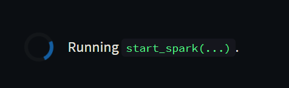
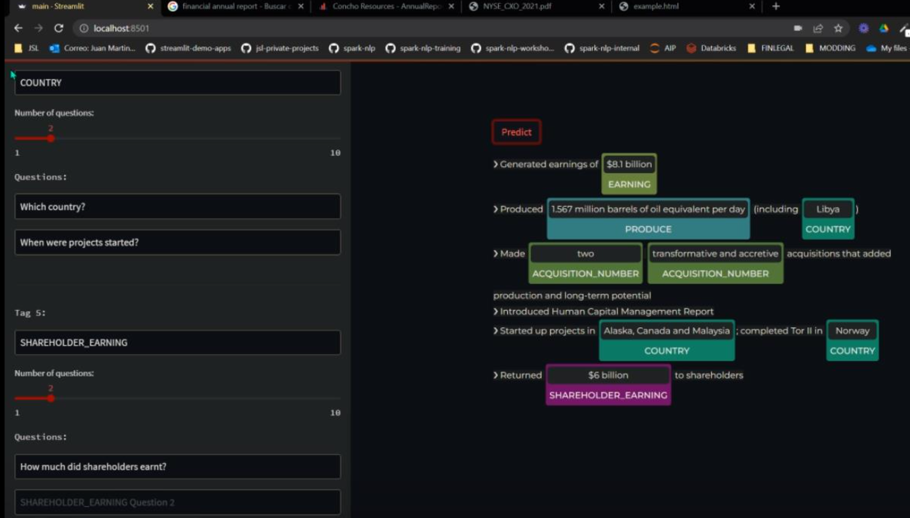

# a Streamlit app to test Zero-shot NER models in Spark NLP

## Instructions
- Fill your license data in `license.json`
- `sudo docker-compose up -d`
- Open a browser on http://localhost:8501 (if you want to change the port, replace it in `docker-compose.yaml`)
- Wait until the Spark Session is created and everything is downloaded and cached. It can take a couple of minutes.

- Create new Tags (NER Labels) and some questions for them. You will see some false positives and negatives, but the more tags and questions, the better it will get!

- Don't forget to save your questions when the work is done!