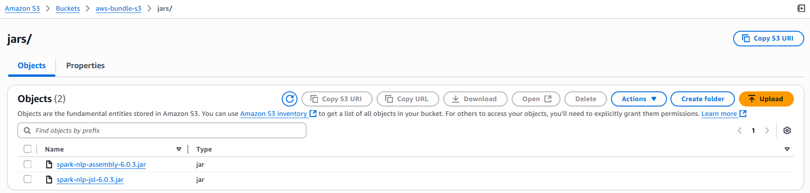

## Air-Gapped Deployment of Spark NLP for Healthcare on AWS EMR

### Overview

This guide explains how to set up **Spark NLP** and **Spark NLP for Healthcare** on **AWS EMR**, using the AWS Console — specifically for **air-gapped environments**.

The configuration is preconfigured and ready to use with **EMR Notebooks**.

---

### Deployment Steps

#### 1 - Open the EMR Service Console

Navigate to the **EMR** service from the AWS Management Console.


---

#### 2 - Create a Cluster and Select Required Applications

Click the **`Create cluster`** button, then select the necessary applications for your Spark NLP workload.

> ✅ **Note:** Please select **Amazon EMR 7.x** (or higher) as the release version.  
> ONNX-based models are not compatible with earlier EMR versions due to system requirements.  
> [Related Discussion](https://github.com/JohnSnowLabs/spark-nlp/issues/14193)


---

#### 3 - Choose EC2 Instance Types for Master and Core (Worker) Nodes

Select appropriate instance types based on your workload and resource needs.


---

#### 4 - Set the Number of Worker Nodes

Adjust the number of worker nodes (core instances) according to your cluster size requirements.


---

#### 5 - Configure VPC and Security Groups

Choose the appropriate **VPC** and **Security Groups** suitable for **air-gapped environments**.  
Ensure that the selected VPC has **no direct internet access**. If an **Internet Gateway** is temporarily required during setup, 
make sure to **remove it after the cluster is created**.  
Also verify that the configuration complies with your organization's **network isolation and security policies**.


#### 6- Attach Internet Gateway Temporarily

Identify the **Route Table** associated with your current **VPC**, and add the **Internet Gateway** to it.
You can use [`jsl_emr_bootstrap.sh`](./jsl_emr_bootstrap.sh) script to install the required libraries and dependencies.


> **Note:** This Internet Gateway is only required during the initial cluster deployment.  
> Once the cluster is up and running, make sure to **detach and delete** the Internet Gateway to convert the cluster into an **air-gapped** environment.

#### 7 - Deploy Without an Internet Gateway (Fully Airgapped)

If your environment requires a **fully air-gapped setup**, you can skip the Internet Gateway attachment step entirely.

Instead, ensure the following:

- All required resources (bootstrap scripts, custom JARs, Python dependencies) are preloaded into an **S3 bucket** or bundled within **Amazon Machine Images (AMIs)** accessible from within the VPC.
- Use **VPC Endpoints** to enable internal-only access to AWS services if necessary.
- Ensure that the **IAM roles** associated with your EMR cluster have sufficient permissions to access these resources.
- Verify that your **security groups** and **network ACLs** allow communication between the EMR cluster and its required internal resources.

  


You can use the [`jsl_emr_bootstrap_from_s3.sh`](./jsl_emr_bootstrap_from_s3.sh) script to install all required libraries and dependencies directly from your internal **S3 bucket**.

📓 To learn how to prepare and upload the required libraries for use in an air-gapped setup, refer to the following notebook:  
➡️ [`Download_Libraries_For_Airgapped_Environment.ipynb`](./Download_Libraries_For_Airgapped_Environment.ipynb)

#### 7 - Add Bootstrap Action and Configure Cluster Logs

We will install the required John Snow Labs Spark libraries using a **bootstrap action**.

Scroll to the bottom of the cluster creation page and expand the **Bootstrap Actions** section.  
Click the **`Add`** button and provide the path to the [`jsl_emr_bootstrap.sh`](./jsl_emr_bootstrap.sh) or [`jsl_emr_bootstrap_from_s3.sh`](./jsl_emr_bootstrap_from_s3.sh) script stored in an **S3 bucket** accessible within your VPC.

---


Additionally, choose an **S3 bucket within your VPC** to store **cluster log files**.  
These logs are critical for troubleshooting and debugging any issues during cluster operation.

---

#### 8 - Configure Spark Parameters in the Software Settings Tab

Define the necessary Spark configuration parameters under the **Software Settings** tab.

> 📘 For more details on available Spark parameters and configurations in EMR, refer to the [official AWS documentation](https://docs.aws.amazon.com/emr/latest/ReleaseGuide/emr-spark-configure.html).

```
[
  {
    "Classification": "spark",
    "Properties": {
      "maximizeResourceAllocation": "true"
    }
  },
  {
    "Classification": "spark-env",
    "Configurations": [
      {
        "Classification": "export",
        "Properties": {
          "JSL_EMR": "1",
          "PYSPARK_PYTHON": "/usr/bin/python3",
          "SPARK_NLP_LICENSE": "XYXYXYXYXY"
        }
      }
    ],
    "Properties": {}
  },
  {
    "Classification": "yarn-env",
    "Configurations": [
      {
        "Classification": "export",
        "Properties": {
          "JSL_EMR": "1",
          "SPARK_NLP_LICENSE": "XYXYXYXYXY"
        }
      }
    ],
    "Properties": {}
  },
  {
    "Classification": "spark-defaults",
    "Properties": {
      "spark.driver.maxResultSize": "0",
      "spark.dynamicAllocation.enabled": "true",
      "spark.executorEnv.SPARK_NLP_LICENSE": "XYXYXYXYXY",
      "spark.jsl.settings.aws.credentials.access_key_id": "XYXYXYXYXY",
      "spark.jsl.settings.aws.credentials.secret_access_key": "XYXYXYXYXY",
      "spark.jsl.settings.aws.region": "us-east-1",
      "spark.jsl.settings.pretrained.credentials.access_key_id": "XYXYXYXYXY",
      "spark.jsl.settings.pretrained.credentials.secret_access_key": "XYXYXYXYXY",
      "spark.kryoserializer.buffer.max": "2000M",
      "spark.rpc.message.maxSize": "1024",
      "spark.serializer": "org.apache.spark.serializer.KryoSerializer",
      "spark.yarn.appMasterEnv.SPARK_NLP_LICENSE": "XYXYXYXYXY",
      "spark.yarn.preserve.staging.files": "true",
      "spark.jsl.settings.storage.cluster_tmp_dir": "hdfs:///tmp",
      "spark.yarn.stagingDir": "hdfs:///tmp"
    }
  }
]
```
**__Important__**  
Make sure to replace all placeholder values (marked as `XYXYXYXYXY`) with the actual credentials provided with your license.  
If your EMR cluster is truly **air-gapped**, you do **not** need to specify `access_key_id` or `secret_access_key` in the configuration — since the `pretrained()` function cannot be used to download models in an offline environment.

---

**Automatic Resource Allocation**  
We do not manually configure driver or executor memory settings. Instead, we enable the `maximizeResourceAllocation` feature, which allows EMR to automatically assign the maximum available resources to Spark.

If you are having issues with the license, please contact JSL team at support@johnsnowlabs.com

---

Under **Tags** section, please add a `KEY: VALUE` pair with `for-use-with-amazon-emr-managed-policies` `true`


#### 9 - Security
After selecting a `EC2 key pair` - to connect the master node with `SSH` and select the IAM roles, we can click on the orange `Create Cluster` button and a Cluster will be created.

#### 10 - Upload Models to an S3 Bucket Within the VPC

Download the desired Spark NLP models from the [Model Hub](https://nlp.johnsnowlabs.com/models).  
You can automate this process using the following helper notebooks:

📎 [Airgapped Model Downloader Notebook](https://github.com/JohnSnowLabs/spark-nlp-workshop/blob/master/platforms/airgap/Airgaped.ipynb)  
📎 [Model Download Helpers – Spark NLP Workshop](https://github.com/JohnSnowLabs/spark-nlp-workshop/blob/master/tutorials/Certification_Trainings/Healthcare/34.Model_Download_Helpers.ipynb)

Once downloaded, upload the unzipped models to an **S3 bucket located within your VPC** so they can be accessed in your air-gapped environment.


#### 11 - License Type

Ensure that you are using the **airgap license type**, which is specifically designed for offline environments.

---

#### 12 - Start the Notebooks Server

To launch the notebooks, create a **Workspace** in **EMR Studio** and attach the cluster you just created.

---

#### 13 - Need Help?

If you have any questions or run into issues, feel free to contact us at **support@johnsnowlabs.com**.

