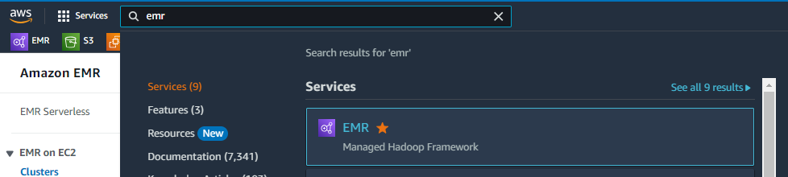
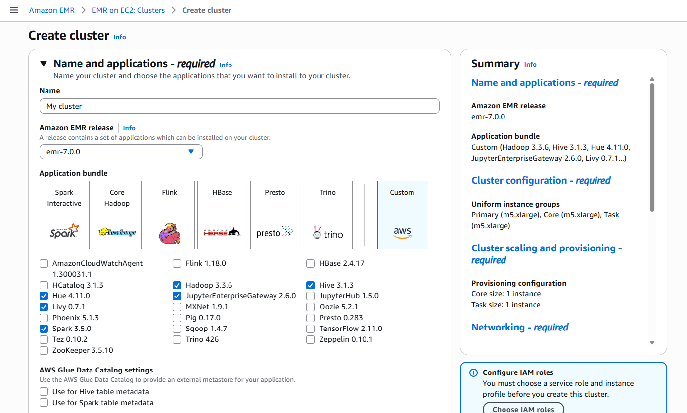
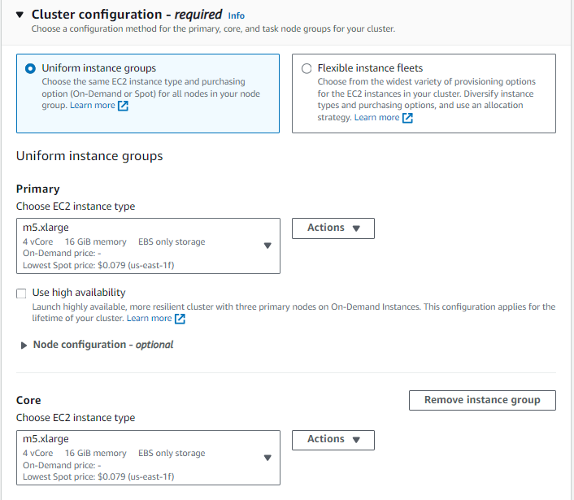
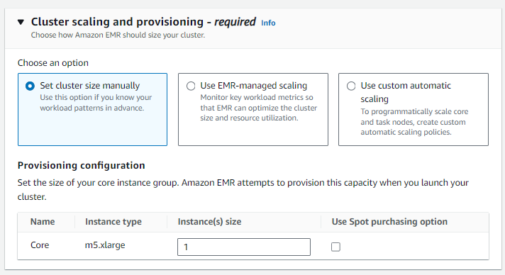
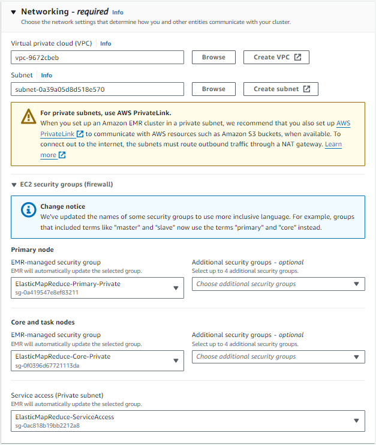

### Spark-NLP for Healthcare in AWS EMR

In this page, we explain how to setup Spark-NLP + Spark-NLP Healthcare in AWS EMR, using the AWS console. Also, You can create an EMR cluster automatically, you should follow [`this tutorial`](https://github.com/JohnSnowLabs/johnsnowlabs/blob/main/notebooks/create_emr_cluster.ipynb) to create EMR cluster automatically.

You can find example healthcare notebooks for EMR clusters in [`this folder`](https://github.com/JohnSnowLabs/spark-nlp-workshop/tree/master/products/emr/healthcare)

This configuration is already ready-to-use for **EMR Notebooks**.

### Steps
#### 1- Go to EMR service



#### 2- Click `create cluster` button, then select required applications:




#### 3-  Select EC2 instances for master and worker nodes:



#### 4 - Specify the number of workers:



#### 5- Specify the VPC and Security Groups (Firewall)
It is recommended to use default configuration or have AWS create default configurations.




#### 6- Add bootstrap action:
We will have Johnsnowlabs Spark libraries installed via bootstrap action.

Go to the bottom of the page, and expand the `Bootstrap Actions` tab. Press on `Add` button. You need to provide a path to a script on S3.


The script we'll use for this setup is `jsl_emr_bootstrap.sh` which is contained in this folder.


You need to put your credentials into `jsl_emr_bootstrap.sh` file <br/>

#### 7. We will define spark parameters under Software settings tab:

```
[
  {
    "Classification": "spark-env",
    "Configurations": [
      {
        "Classification": "export",
        "Properties": {
          "JSL_EMR": "1",
          "PYSPARK_PYTHON": "/usr/bin/python3",
          "SPARK_NLP_LICENSE": "XYXYXYXYXY"
        }
      }
    ],
    "Properties": {}
  },
  {
    "Classification": "yarn-env",
    "Configurations": [
      {
        "Classification": "export",
        "Properties": {
          "JSL_EMR": "1",
          "SPARK_NLP_LICENSE": "XYXYXYXYXY"
        }
      }
    ],
    "Properties": {}
  },
  {
    "Classification": "spark-defaults",
    "Properties": {
      "spark.driver.maxResultSize": "0",
      "spark.driver.memory": "64G",
      "spark.dynamicAllocation.enabled": "true",
      "spark.executor.memory": "64G",
      "spark.executorEnv.SPARK_NLP_LICENSE": "XYXYXYXYXY",
      "spark.jsl.settings.aws.credentials.access_key_id": "XYXYXYXYXY",
      "spark.jsl.settings.aws.credentials.secret_access_key": "XYXYXYXYXY",
      "spark.jsl.settings.aws.region": "us-east-1",
      "spark.jsl.settings.pretrained.credentials.access_key_id": "XYXYXYXYXY",
      "spark.jsl.settings.pretrained.credentials.secret_access_key": "XYXYXYXYXY",
      "spark.kryoserializer.buffer.max": "2000M",
      "spark.rpc.message.maxSize": "1024",
      "spark.serializer": "org.apache.spark.serializer.KryoSerializer",
      "spark.yarn.appMasterEnv.SPARK_NLP_LICENSE": "XYXYXYXYXY",
      "spark.yarn.preserve.staging.files": "true",
      "spark.yarn.stagingDir": "hdfs:///tmp"
    }
  }
]
```
**__Important__**:
Make sure that you replace all the secret information(marked here as XYXYXYXYXY) with the appropriate values that you received with your license.<br/> 

If you are having issues with the license, please contact JSL team at support@johnsnowlabs.com


Under **Tags** section, please add a `KEY: VALUE` pair with `for-use-with-amazon-emr-managed-policies` `true`


#### 7- Security
After selecting a `EC2 key pair` - to connect the master node with `SSH` and select the IAM roles, we can click on the orange `Create Cluster` button and a Cluster will be created.

#### 8-
Make sure that license.johnsnowlabs.com and licensecheck.johnsnowlabs.com are on whitelist domains. If they are not, please whitelist these domains.

#### 9- Start Notebooks Server

To open the Notebooks, you can create Workspaces from EMR Studio and attach the Cluster that you just created.

#### 9- Any Doubt?
Write us to support@johnsnowlabs.com
