# Deploy Spark NLP for Healthcare on GCP Dataproc (Classical way)

A detailed, step-by-step guide (with screenshots) to set up and run Spark NLP for Healthcare using Google Cloud Dataproc (Classical way).

---


## Prerequisites

- **Google Cloud Project** with billing enabled.
- Enabled APIs (you may need to enable others):
  - Dataproc API
  - Cloud Storage API
  - Compute Engine API
- **Permissions** to manage buckets, clusters, and submit jobs. (You may need other permissions).
- Downloaded:
  - Spark NLP assembly & JSL JARs
  - Spark NLP & JSL wheel files
  - Pipeline code & init script
  - Helthcare Model(s)

---

## Step 1: Create a new GCS 

Create a bew bucket from Cloud Storage Service (e.g., `spark-healthcare-nlp`).

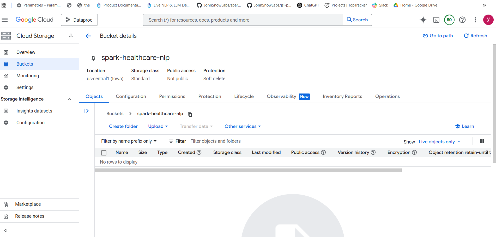

---

## Step 2: Uploading resources to the GCS

Organize your bucket by creating subfolders for jars, whls, and models, then upload the corresponding resources.


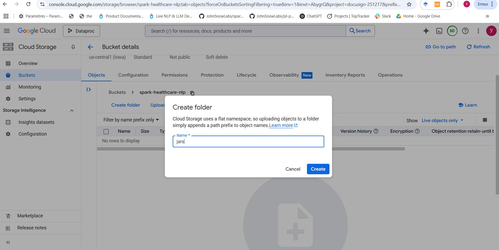
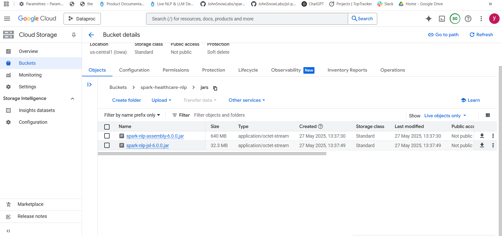
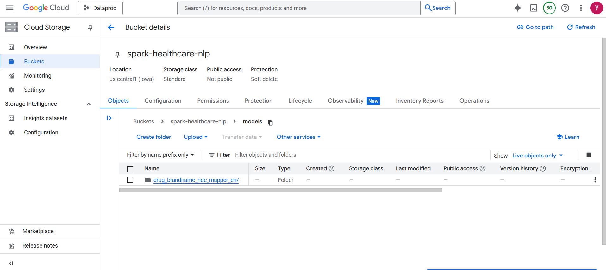
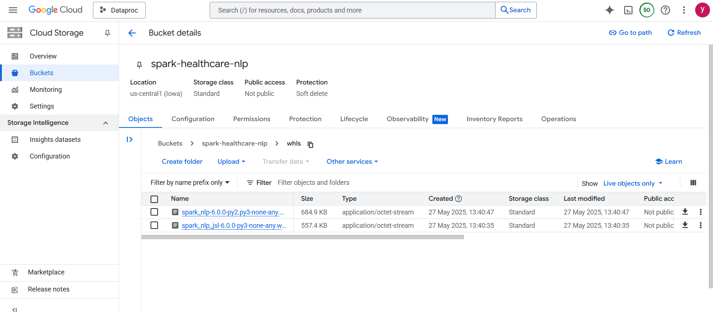

Upload also the init script as well as the py pipeline code to the root of the bucket.

The bucket should looks like showing in the following figure:

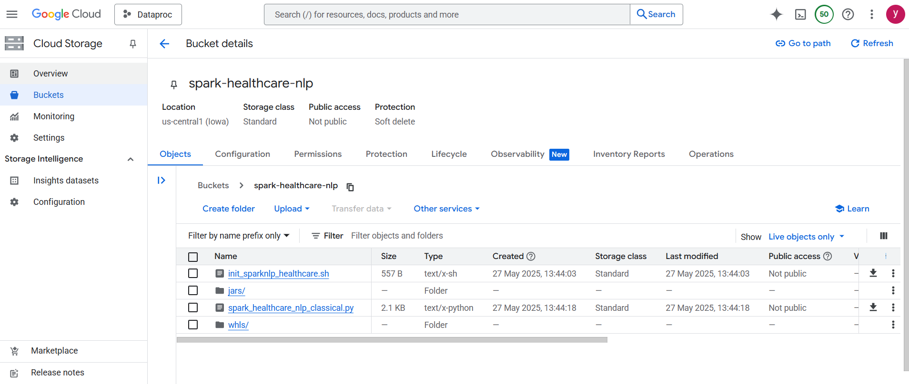

---

## Step 3: Dataproc service

Search for dataproc in the Google Cloud Console to find the Dataproc service.


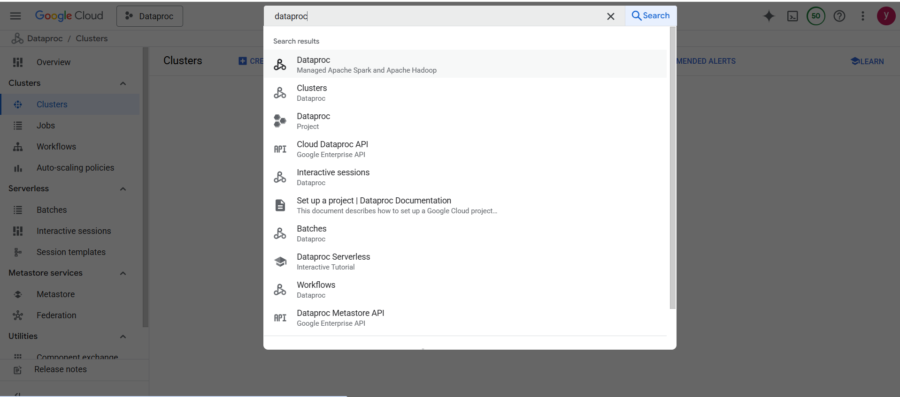

---

## Step 4: Start the Dataproc Cluster

Click on the Cloud Shell (top-right) to start a shell session:

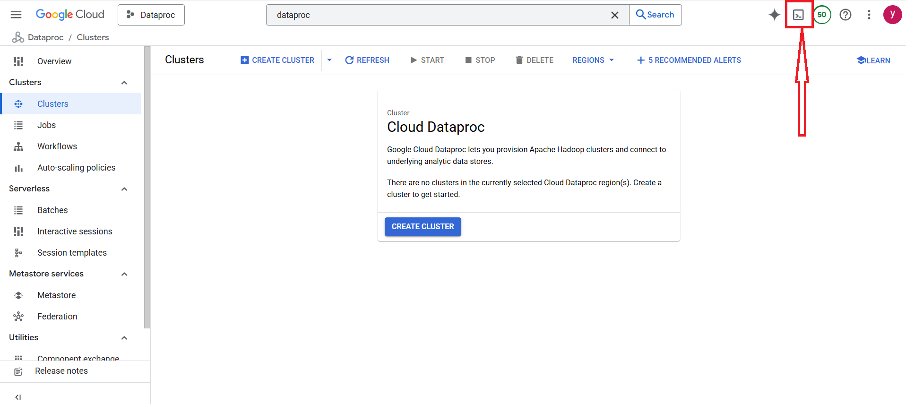

Then  start your cluster, using the init script:

```bash
gcloud dataproc clusters create sparknlp-healthcare \
  --region=us-central1 \
  --zone=us-central1-a \
  --image-version=2.0-debian10 \
  --initialization-actions=gs://spark-healthcare-nlp/init_sparknlp_healthcare.sh
```

As shown in the screenshot below:

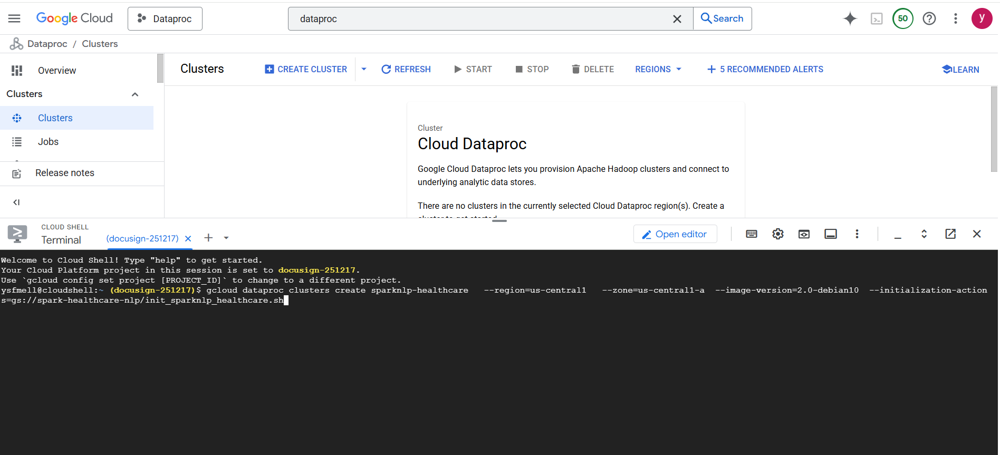

Make sure it's starting:

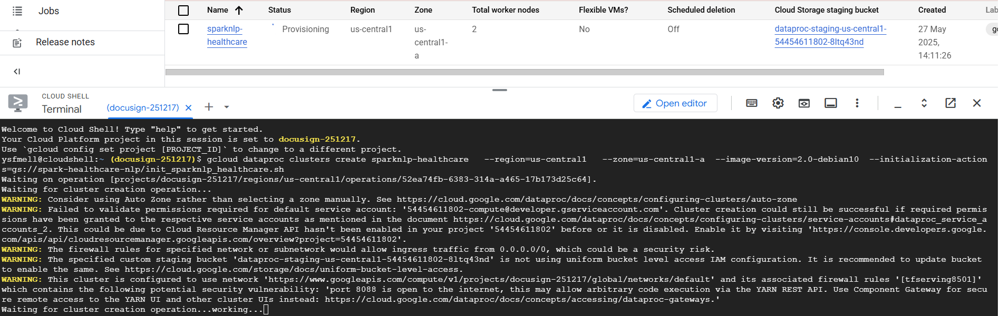


---


## Step 5: Verify Cluster Creation

Once you run the cluster creation command, you should see your cluster in a Running state in the Dataproc Clusters list.
The Cloud Shell terminal will confirm cluster creation is done.

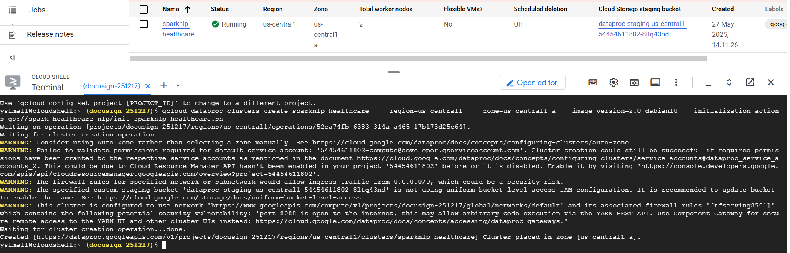

---

## Step 6: Submit Your Spark NLP Job

Submit your pipeline to the running Dataproc cluster using the following command in Cloud Shell:

```bash
gcloud dataproc jobs submit pyspark gs://spark-healthcare-nlp/spark_healthcare_nlp_classical.py \
  --cluster=sparknlp-healthcare \
  --region=us-central1 \
  --jars=gs://spark-healthcare-nlp/jars/spark-nlp-jsl-6.0.0.jar,gs://spark-healthcare-nlp/jars/spark-nlp-assembly-6.0.0.jar \
  --properties="\
spark.driver.extraJavaOptions=-Djsl.settings.license=<YOUR_LICENSE>,\
spark.executor.extraJavaOptions=-Djsl.settings.license=<YOUR_LICENSE>,\
spark.extraListeners=com.johnsnowlabs.license.LicenseLifeCycleManager"
```
Please make sure to replace <YOUR_LICENSE> with your valide JSL license.

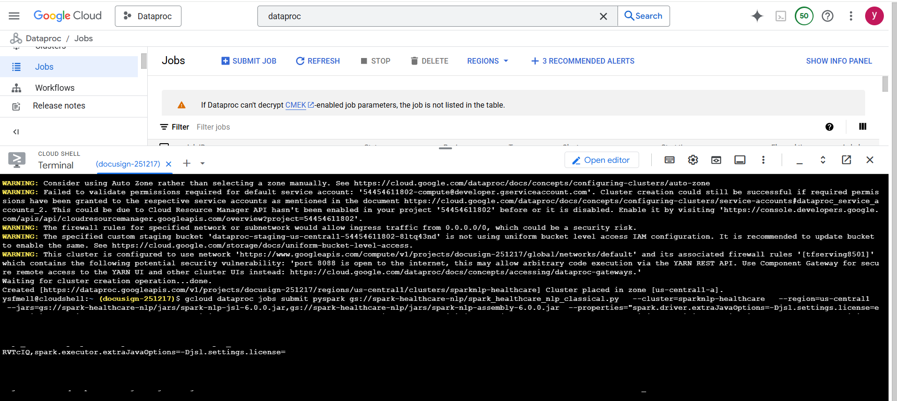

---

## Step 6.1: (Alternative) Submit Your Spark NLP Job using Secret Manager

Alternatively to the above step, you can also store the licence in Google Cloud Secret Manager.

Submit your pipeline to the running Dataproc cluster using the following command in Cloud Shell:

```bash
# Create secret
gcloud secrets create jsl_license --replication-policy="automatic" --project=docusign-251217

# Add licence to secret
echo -n "<YOUR_LICENSE>" | gcloud secrets versions add jsl_license --data-file=- --project=docusign-251217

# Add permissions
gcloud secrets add-iam-policy-binding jsl_license --member="serviceAccount:<SERVICE ACCOUNT EMAIL>" --role="roles/secretmanager.secretAccessor" --project=docusign-251217

# Then you can use the secret to submit the job
gcloud dataproc jobs submit pyspark gs://spark-healthcare-nlp/spark_healthcare_nlp_classical.py \
  --cluster=sparknlp-healthcare \
  --region=us-central1 \
  --jars=gs://spark-healthcare-nlp/jars/spark-nlp-jsl-6.0.0.jar,gs://spark-healthcare-nlp/jars/spark-nlp-assembly-6.0.0.jar \
  --properties="\
spark.driver.extraJavaOptions=-Djsl.settings.license=$(gcloud secrets versions access latest --secret=jsl_license --project=docusign-251217),\
spark.executor.extraJavaOptions=-Djsl.settings.license=$(gcloud secrets versions access latest --secret=jsl_license --project=docusign-251217),\
spark.extraListeners=com.johnsnowlabs.license.LicenseLifeCycleManager"
```

Please make sure to replace <YOUR_LICENSE> with your valide JSL license.

---

## Step 13: Track Job Progress

Monitor the job execution in the Dataproc Jobs tab and in Cloud Shell logs.  
You can see the job’s status (e.g., Starting) and logs being printed in real-time.

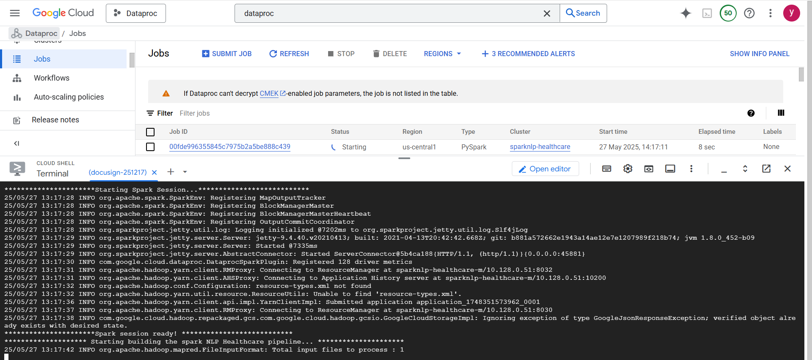

---

## Step 14: View Results and Job Completion

As the pipeline runs, logs and output will be displayed in the terminal.  
Once the job finishes, you’ll see confirmation of successful completion and model results.

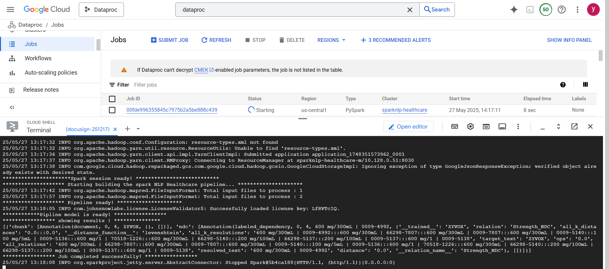

---

## Step 15: Job Succeeded - Check Outputs

When the job is finished, the status in the Jobs list changes to **Succeeded**.  
Check the logs and outputs to validate your Spark NLP Healthcare job ran correctly.

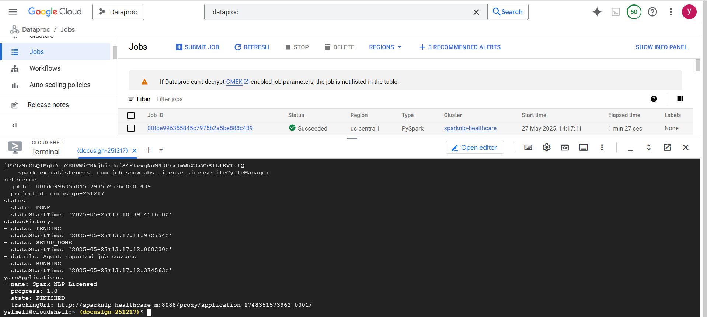

---

