# Deploy Spark NLP for Healthcare on GCP Dataproc (Classical way)

A detailed, step-by-step guide (with screenshots) to set up and run Spark NLP for Healthcare using Google Cloud Dataproc (Classical way).

---

## Table of Contents

1. [Prerequisites](#prerequisites)
2. [Step 1: Open the Dataproc Console](#step-1-open-the-dataproc-console)
3. [Step 2: Go to the Dataproc Clusters Section](#step-2-go-to-the-dataproc-clusters-section)
4. [Step 3: Open Cloud Shell](#step-3-open-cloud-shell)
5. [Step 4: Create a GCS Bucket](#step-4-create-a-gcs-bucket)
6. [Step 5: Create Folders in GCS Bucket](#step-5-create-folders-in-gcs-bucket)
7. [Step 6: Upload JARs](#step-6-upload-jars)
8. [Step 7: Upload Model/Data Folders](#step-7-upload-modeldata-folders)
9. [Step 8: Upload Python Wheels](#step-8-upload-python-wheels)
10. [Step 9: Upload Pipeline Code and Init Script](#step-9-upload-pipeline-code-and-init-script)
11. [Step 10: Start the Dataproc Cluster](#step-10-start-the-dataproc-cluster)
12. [Step 11: Verify Cluster Creation](#step-11-verify-cluster-creation)
13. [Step 12: Submit Your Spark NLP Job](#step-12-submit-your-spark-nlp-job)
14. [Step 13: Track Job Progress](#step-13-track-job-progress)
15. [Step 14: View Results and Job Completion](#step-14-view-results-and-job-completion)
16. [Step 15: Job Succeeded - Check Outputs](#step-15-job-succeeded---check-outputs)
17. [References](#references)

---

## Prerequisites

- **Google Cloud Project** with billing enabled.
- Enabled APIs (you may need to enable others):
  - Dataproc API
  - Cloud Storage API
  - Compute Engine API
- **Permissions** to manage buckets, clusters, and submit jobs. (You may need other permissions).
- Downloaded:
  - Spark NLP assembly & JSL JARs
  - Spark NLP & JSL wheel files
  - Pipeline code & init script
  - Helthcare Model(s)

---

## Step 1: Open the Dataproc Console

Search for `dataproc` in the Google Cloud Console to find the Dataproc service.

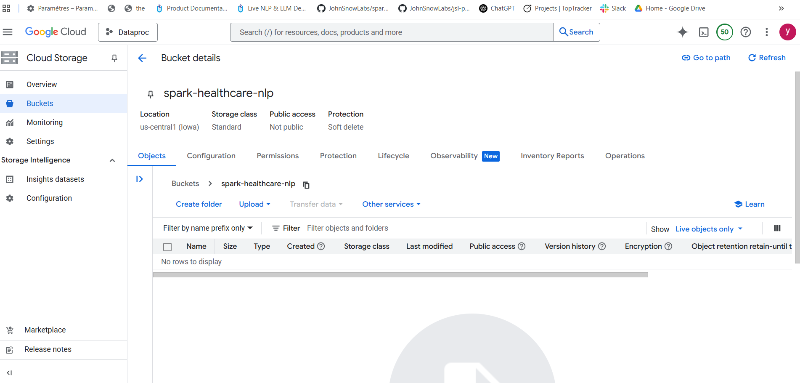

---

## Step 2: Go to the Dataproc Clusters Section

Click on **Clusters** in the Dataproc menu.

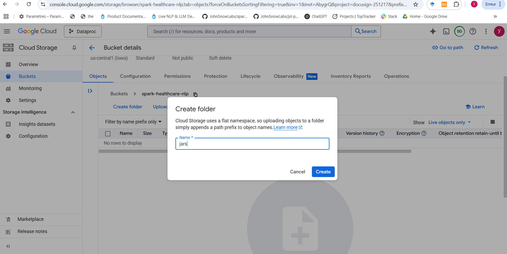

---

## Step 3: Open Cloud Shell

You’ll use Cloud Shell for CLI commands throughout the process.

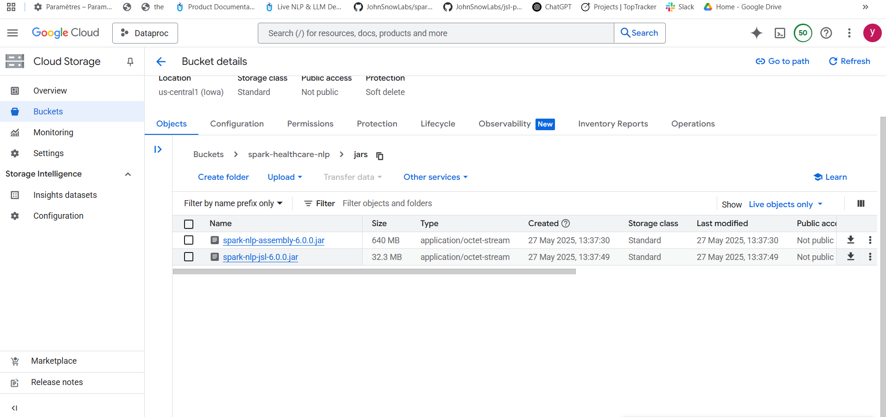

---

## Step 4: Create a GCS Bucket

Go to Cloud Storage and create a new bucket (e.g., `spark-healthcare-nlp`).

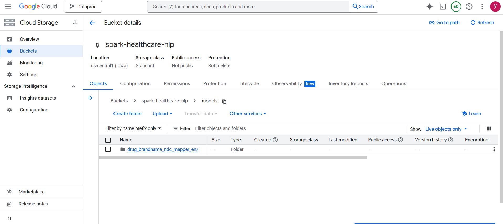

---

## Step 5: Create Folders in GCS Bucket

Organize your bucket by creating subfolders for `jars`, `whls`, and `models`.

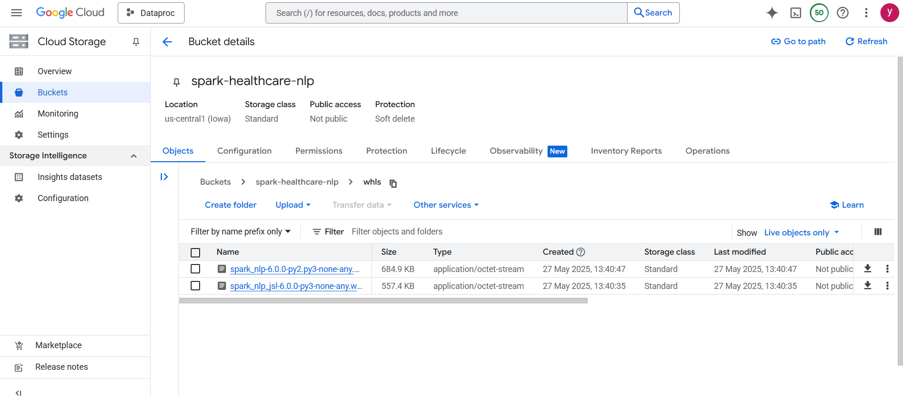

---

## Step 6: Upload JARs

Upload the Spark NLP assembly and JSL JAR files into the `jars` folder.

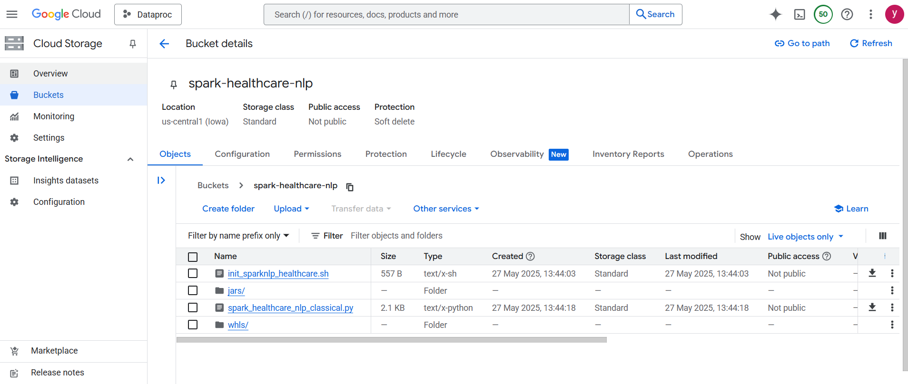

---

## Step 7: Upload Model/Data Folders

Upload any models or data you need (for example, pre-trained models).

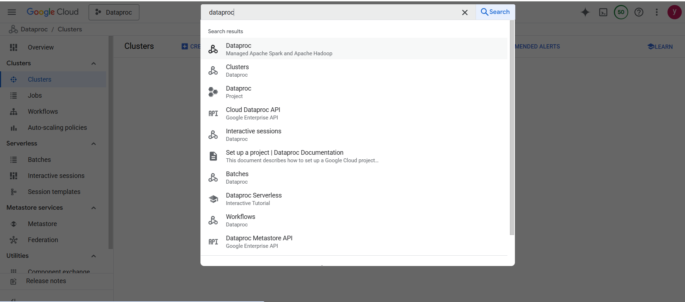

---

## Step 8: Upload Python Wheels

Upload the required Python wheel (`.whl`) files into the `whls` folder.

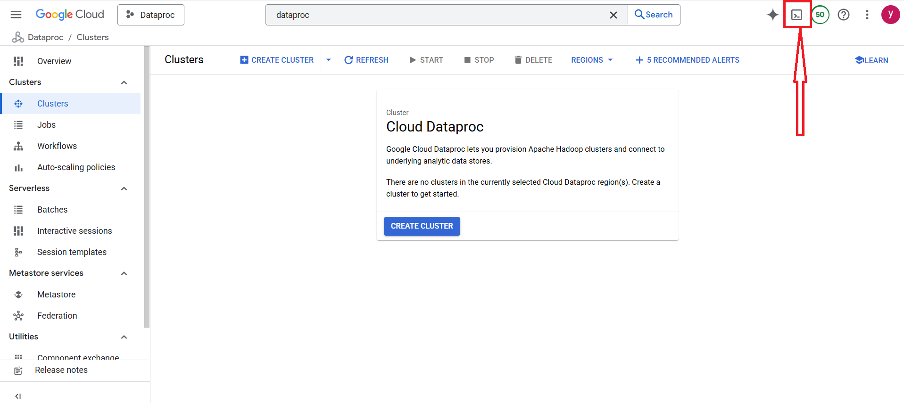

---

## Step 9: Upload Pipeline Code and Init Script

Upload your pipeline Python file and initialization shell script to the bucket root.

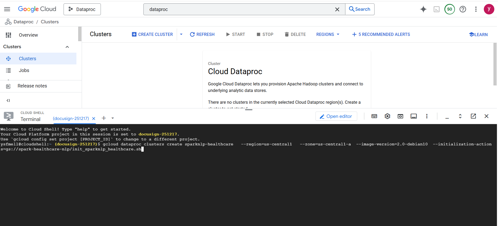

---

## Step 10: Start the Dataproc Cluster

Run the following command in Cloud Shell to start your cluster, using the init script:

```bash
gcloud dataproc clusters create sparknlp-healthcare \
  --region=us-central1 \
  --zone=us-central1-a \
  --image-version=2.0-debian10 \
  --initialization-actions=gs://spark-healthcare-nlp/init_sparknlp_healthcare.sh
```

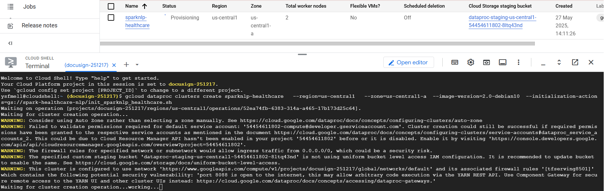

## Step 11: Verify Cluster Creation

Once you run the cluster creation command, you should see your cluster in a **Running** state in the Dataproc Clusters list.  
The Cloud Shell terminal will confirm cluster creation is done.

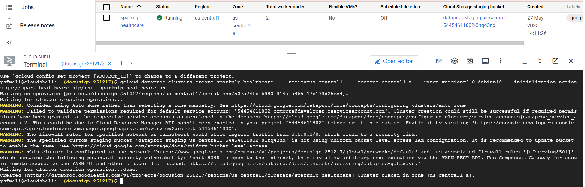

---

## Step 12: Submit Your Spark NLP Job

Submit your pipeline to the running Dataproc cluster using the following command in Cloud Shell:

```bash
gcloud dataproc jobs submit pyspark gs://spark-healthcare-nlp/spark_healthcare_nlp_classical.py \
  --cluster=sparknlp-healthcare \
  --region=us-central1 \
  --jars=gs://spark-healthcare-nlp/jars/spark-nlp-jsl-6.0.0.jar,gs://spark-healthcare-nlp/jars/spark-nlp-assembly-6.0.0.jar \
  --properties="\
spark.driver.extraJavaOptions=-Djsl.settings.license=<YOUR_LICENSE>,\
spark.executor.extraJavaOptions=-Djsl.settings.license=<YOUR_LICENSE>,\
spark.extraListeners=com.johnsnowlabs.license.LicenseLifeCycleManager"
```
Please make sure to replace <YOUR_LICENSE> with your valide JSL license.

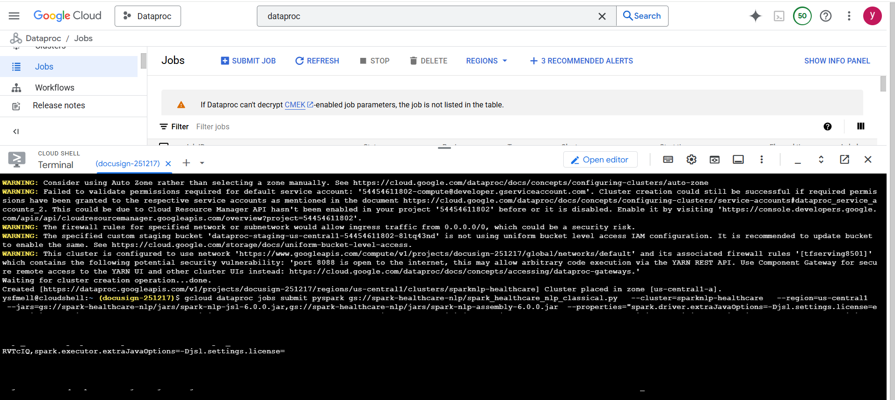

---

## Step 13: Track Job Progress

Monitor the job execution in the Dataproc Jobs tab and in Cloud Shell logs.  
You can see the job’s status (e.g., Starting) and logs being printed in real-time.

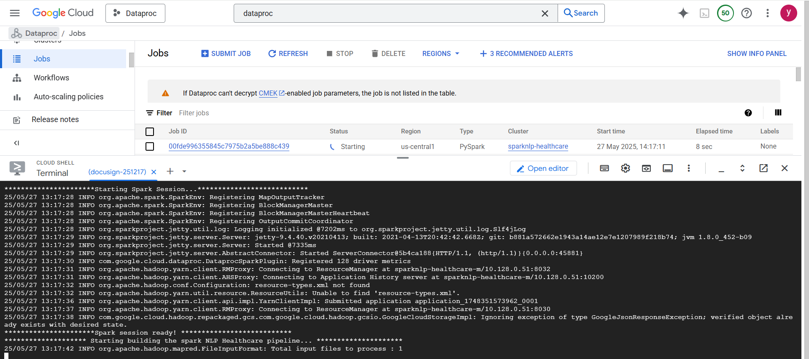

---

## Step 14: View Results and Job Completion

As the pipeline runs, logs and output will be displayed in the terminal.  
Once the job finishes, you’ll see confirmation of successful completion and model results.

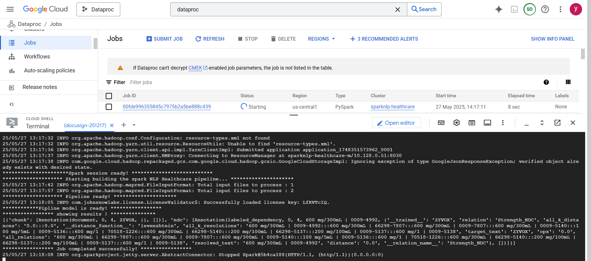

---

## Step 15: Job Succeeded - Check Outputs

When the job is finished, the status in the Jobs list changes to **Succeeded**.  
Check the logs and outputs to validate your Spark NLP Healthcare job ran correctly.

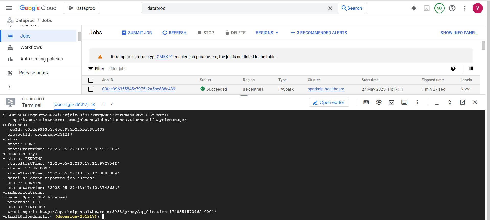

---

