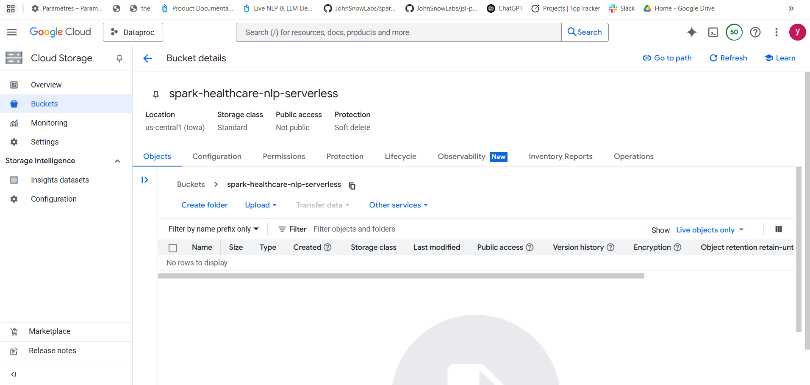
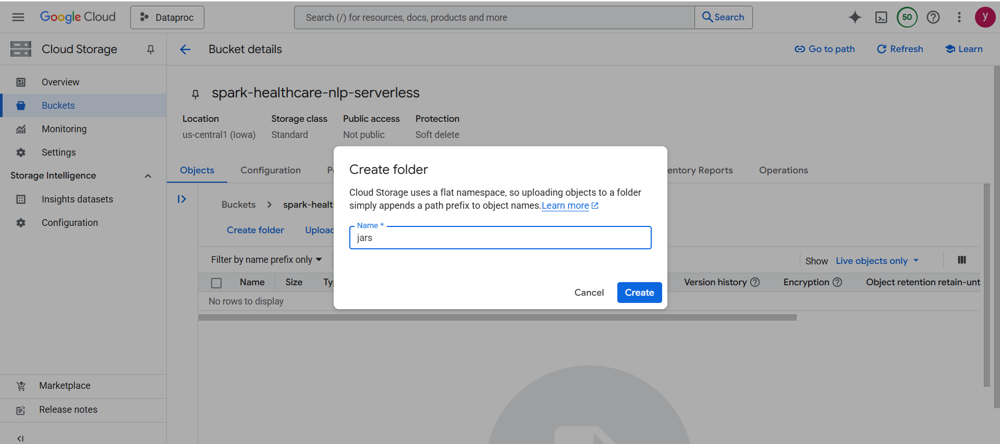
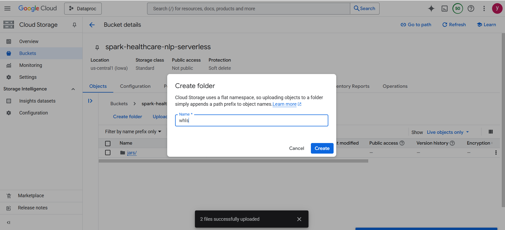
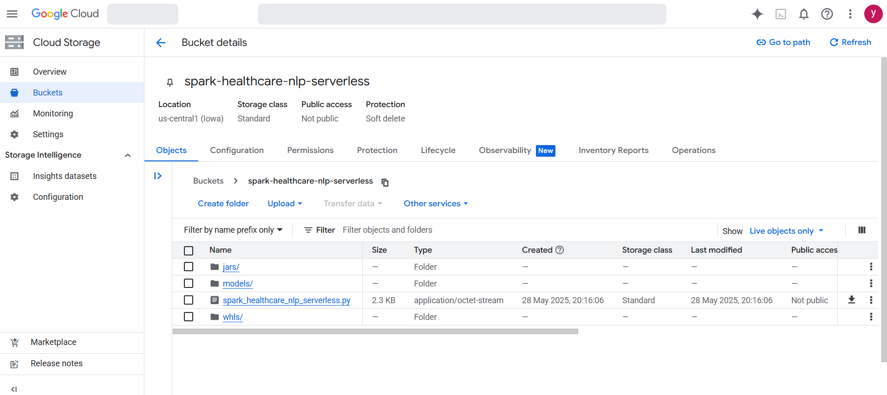
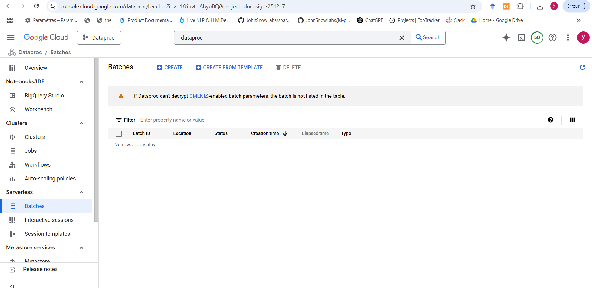
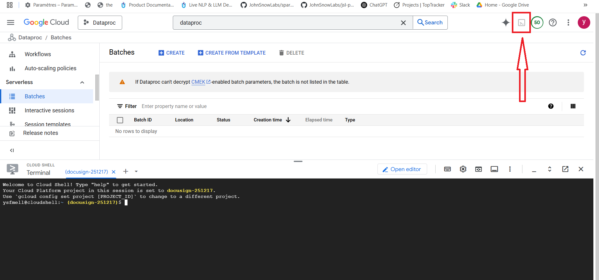
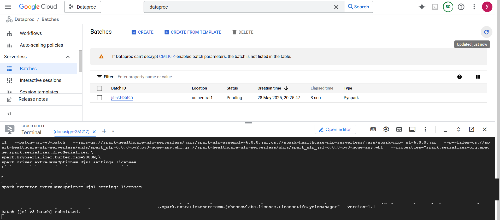
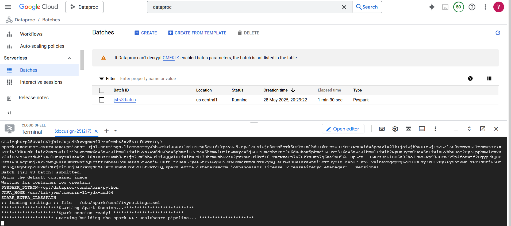
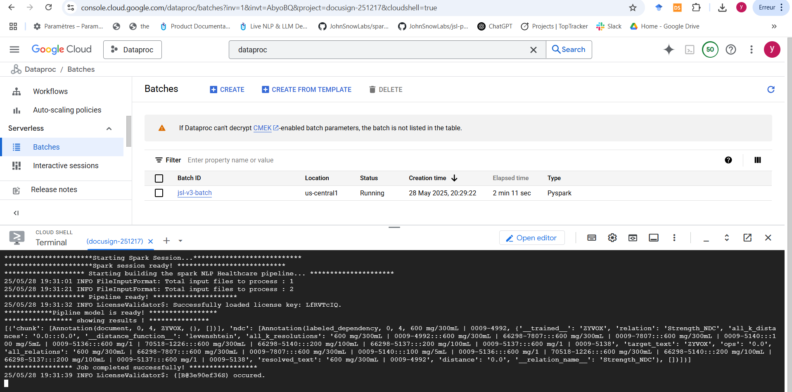
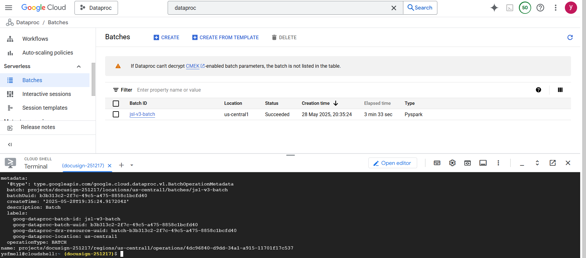

# Deploy Spark NLP for Healthcare on GCP Dataproc (Serverless way)

A detailed, step-by-step guide (with screenshots) to set up and run Spark NLP for Healthcare using Google Cloud Dataproc (Serverless way).

---


## Prerequisites

- **Google Cloud Project** with billing enabled.
- Enabled APIs (you may need to enable others):
  - Dataproc API
  - Cloud Storage API
  - Compute Engine API
- **Permissions** to manage buckets, clusters, and submit jobs. (You may need other permissions).
- Downloaded:
  - Spark NLP assembly & JSL JARs
  - Spark NLP & JSL wheel files
  - Pipeline code
  - Healthcare Model(s)

---

## Step 1: Create a new GCS 

Create a bew bucket from Cloud Storage Service (e.g., `spark-healthcare-nlp-serverless`).



---

## Step 2: Uploading resources to the GCS

Organize your bucket by creating subfolders for jars, whls, and models, then upload the corresponding resources.





Upload also the py pipeline code to the root of the bucket.

The bucket should looks like showing in the following figure:



---

## Step 3: Dataproc service

Search for dataproc in the Google Cloud Console to find the Dataproc service.




---


## Step 4: Submit Your Spark NLP Batch on serverless mode

Click on the Cloud Shell (top-right) to start a shell session:



Then submit your pipeline in serverless mode using the following command in Cloud Shell:

```bash
gcloud dataproc batches submit pyspark gs://spark-nlp-demo/spark_healthcare_nlp_serverless.py   --project=docusign-251217   --region=us-central1   --batch=jsl-batch   --jars=gs://spark-nlp-demo/spark-nlp-assembly-6.0.0.jar,gs://spark-nlp-demo/spark-nlp-jsl-6.0.0.jar   --py-files=gs://spark-nlp-demo/python/spark_nlp-6.0.0-py2.py3-none-any.whl,gs://spark-nlp-demo/python/spark_nlp_jsl-6.0.0-py3-none-any.whl   --properties="spark.serializer=org.apache.spark.serializer.KryoSerializer,\
spark.kryoserializer.buffer.max=2000M,\
spark.driver.extraJavaOptions=-Djsl.settings.license=<YOUR_LICENSE>,\
spark.executor.extraJavaOptions=-Djsl.settings.license=<YOUR_LICENSE>,\
--version=1.1
```
Please make sure to replace <YOUR_LICENSE> with your valide JSL license.		



---

## Step 13: Track Batch Progress

Monitor the Batch execution in the Dataproc Serverless Barches tab and in Cloud Shell logs.  
You can see the batch’s status (e.g., Running) and logs being printed in real-time.



---

## Step 14: View Results and Batch Completion

As the pipeline runs, logs and output will be displayed in the terminal.  
Once the Batch finishes, you’ll see confirmation of successful completion and model results.



---

## Step 15: Batch Succeeded - Check Outputs

When the batch is finished, the status in the Batch list changes to **Succeeded**.  
Check the logs and outputs to validate your Spark NLP Healthcare job ran correctly.



---

